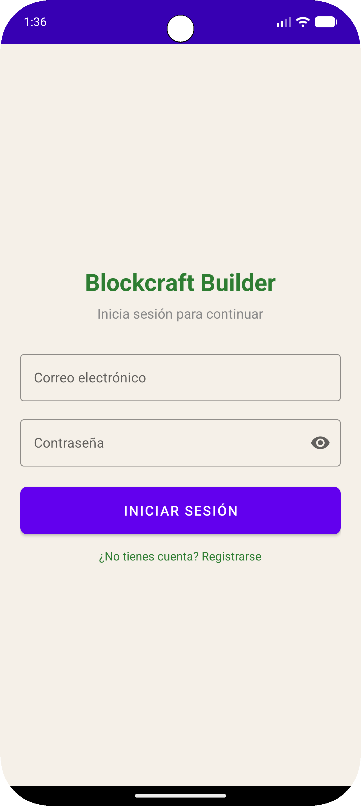
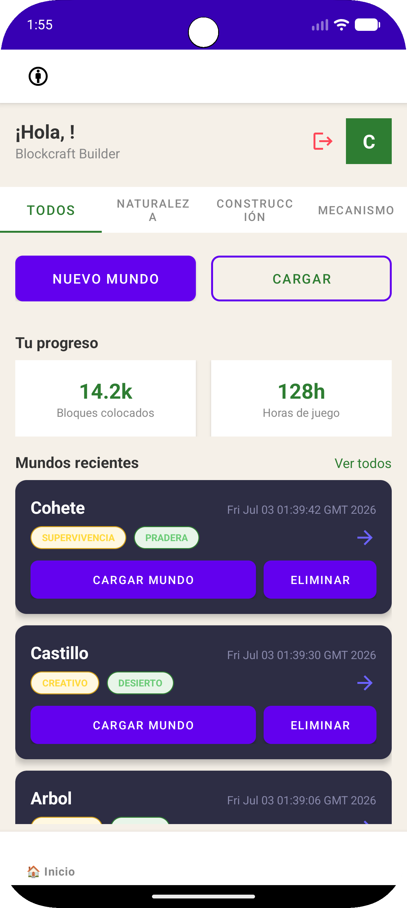
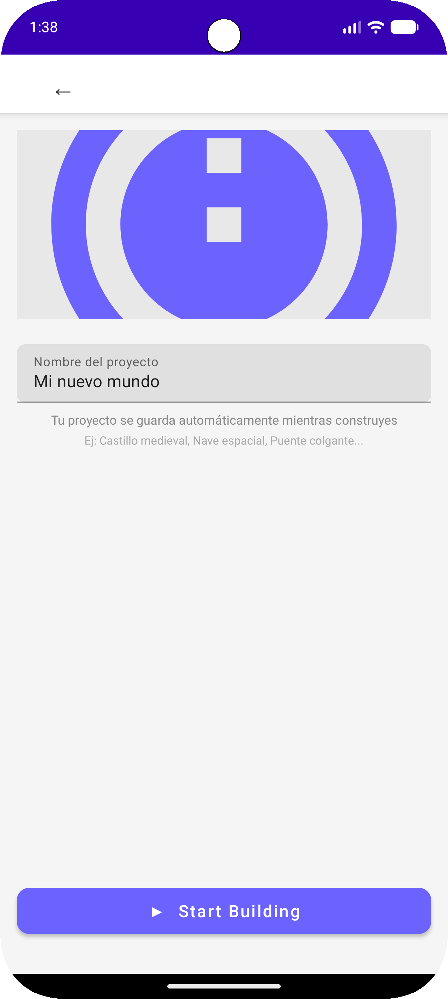
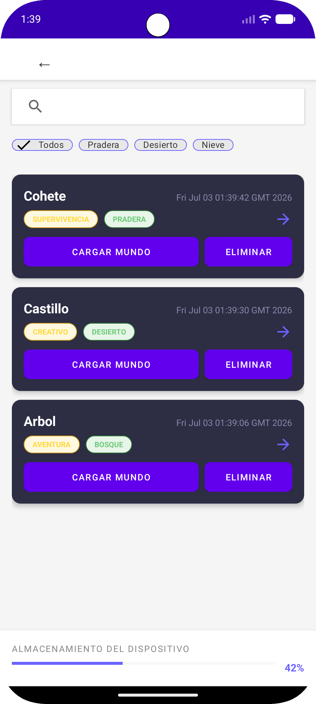
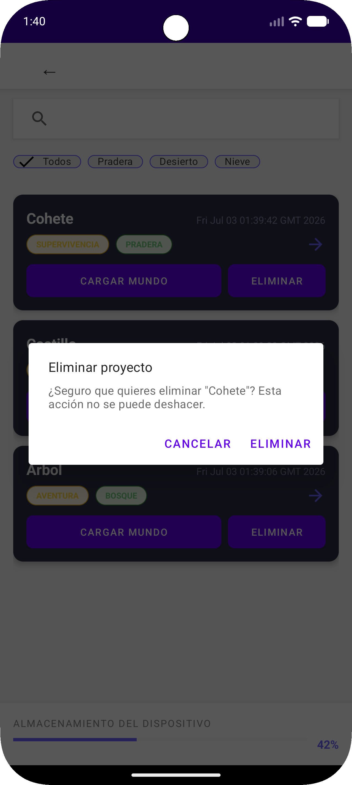
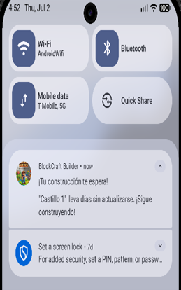

# 🧱 Blockcraft Builder

> **Construye sin límites. Sin conexión. Sin complicaciones.**

Aplicación Android nativa de construcción 3D con bloques, diseñada para
usuarios de 8 a 16 años. Funciona 100% offline con Room Database.

---

## 📋 Tabla de Contenidos
- [Descripción del Problema](#-descripción-del-problema)
- [Historias de Usuario](#-historias-de-usuario--mvp)
- [Arquitectura de Datos](#-arquitectura-de-datos)
- [Tecnologías](#️-tecnologías-utilizadas)
- [Notificaciones](#-notificaciones-locales)
- [Cómo probar el CRUD](#-cómo-probar-el-crud)
- [Capturas de Pantalla](#-capturas-de-pantalla)
- [Estado del Proyecto](#-estado-del-proyecto)
- [Instalación](#️-instalación)

---

## 🚧 Descripción del Problema

Los juegos de construcción más populares del mercado móvil presentan
barreras que frustran la experiencia:

- **Complejidad elevada** — curvas de aprendizaje empinadas
- **Dependencia de Internet** — requieren conexión constante
- **Microtransacciones agresivas** — condicionan el progreso

**Blockcraft Builder** resuelve esto con:
- ✅ Entorno **sencillo e intuitivo** desde los primeros minutos
- ✅ Funcionamiento **100% offline** sin servidores externos
- ✅ Experiencia **libre de micropagos**
- ✅ Orientado a **niños y adolescentes de 8 a 16 años**

---

## 👤 Historias de Usuario — MVP

| ID | Rol | Necesidad | Beneficio |
|---|---|---|---|
| **HU-01** | Jugador | Guardar mi construcción con un nombre y recuperarla | Continuar sin perder el progreso |
| **HU-02** | Jugador joven | Deshacer la colocación del último bloque | Corregir errores sin reiniciar |
| **HU-03** | Adulto creativo | Navegar bloques organizados por categoría | Encontrar rápidamente el bloque |
| **HU-04** | Usuario creativo | Exportar y compartir una captura | Mostrar y guardar mi trabajo |
| **HU-05** | Jugador preciso | Activar/desactivar cuadrícula visual | Colocar bloques ordenadamente |

---

## 📐 Arquitectura de Datos

La app sigue el patrón **MVVM** con separación estricta de capas:

UI (Activity / RecyclerView)
↓ observa LiveData ↑
ViewModel (ProyectoViewModel)
↓ delega ↑
Repository (ProyectoRepository)
↓ consulta ↑
DAO (ProyectoDao / BloqueDao)
↓ persiste ↑
Room Database (blockcraft_database — SQLite)


**Regla principal:** Cada capa solo se comunica con la
capa inmediatamente vecina. La UI nunca accede al DAO directamente.

### Entidades Room

| Entidad | Campos principales |
|---|---|
| `Proyecto` | id, nombre, tipo, bioma, fechaCreacion, cantidadBloques |
| `Bloque` | id, proyectoId (FK), tipo, posX, posY, posZ |

---

## 🛠️ Tecnologías Utilizadas

| Capa | Tecnología |
|---|---|
| **Lenguaje** | Kotlin |
| **Arquitectura** | MVVM + Repository Pattern |
| **Base de datos** | Room Database (SQLite) |
| **Estado reactivo** | ViewModel + LiveData + Flow |
| **Notificaciones** | WorkManager + NotificationCompat |
| **Autenticación** | Firebase Authentication |
| **UI Components** | Material Design 3 |
| **Listas** | RecyclerView + DiffUtil |
| **IDE** | Android Studio |
| **Control versiones** | Git + GitHub |

### Estructura del Proyecto

```
app/src/main/java/com/cacuango/blockcraft_builder/
├── BlockcraftApp.kt
├── data/
│   ├── local/
│   │   ├── dao/              # ProyectoDao, BloqueDao
│   │   ├── database/         # AppDatabase (Room Singleton)
│   │   └── Entity/           # Proyecto, Bloque
│   └── repository/           # ProyectoRepository
├── ui/
│   ├── auth/                 # LoginActivity, RegisterActivity
│   ├── create/               # CreateProjectActivity
│   ├── editor/               # EditorActivity
│   ├── home/                 # MainActivity
│   └── load/                 # LoadWorldActivity, MundoAdapter
├── viewmodel/                # ProyectoViewModel
└── workers/                  # RecordatorioWorker
```

## 🔔 Notificaciones Locales

La app no consume ninguna API REST externa. Funciona completamente
offline. Las notificaciones se implementan con **WorkManager**:

| Canal | Descripción | Frecuencia | HU |
|---|---|---|---|
| `canal_recordatorios` | Proyecto sin abrir en 3 días | Cada 3 días | HU-01 |
| `canal_guardado` | Confirmación de guardado automático | Cada 5 min (activo) | HU-01 |
| `canal_logros` | Hito de bloques alcanzado | Al superar umbral | HU-02, HU-05 |
| `canal_exportacion` | Captura lista en galería | Inmediata | HU-04 |

**¿Por qué WorkManager y no AlarmManager?**
WorkManager respeta las restricciones de batería, sobrevive a
reinicios del dispositivo y garantiza ejecución aunque la app esté cerrada.

---

## ✅ Cómo probar el CRUD

### Requisitos previos
- Android Studio Hedgehog o superior
- Emulador con API 33+ (Pixel 9 Pro recomendado)
- Cuenta de Firebase para el login

### CREATE — Crear un proyecto
1. Iniciar sesión con email y contraseña
2. Tocar **"Nuevo mundo"** en la pantalla principal
3. Escribir un nombre (mín. 3 caracteres, solo letras y números)
4. Tocar **"Start Building"**
5. Verificar que el proyecto aparece en **"Cargar mundo"**

### READ — Ver la lista de proyectos
1. Tocar **"Cargar mundo"** desde la pantalla principal
2. Verificar que aparecen todos los proyectos creados
3. Usar la **barra de búsqueda** para filtrar por nombre
4. Usar los **chips** (Todos / Pradera / Desierto / Nieve) para filtrar

### UPDATE — Editar un proyecto
1. En **"Cargar mundo"** tocar el botón **"Cargar mundo"** de cualquier ítem
2. Verificar que el formulario se abre con el **nombre precargado**
3. Cambiar el nombre y tocar **"Guardar cambios"**
4. Verificar que la lista muestra el **nombre actualizado**

### DELETE — Eliminar un proyecto
1. En **"Cargar mundo"** tocar **"Eliminar"** en cualquier ítem
2. Verificar que aparece el **AlertDialog de confirmación**
3. Tocar **"Eliminar"** para confirmar
4. Verificar que aparece el **Snackbar con "Deshacer"**
5. Tocar **"Deshacer"** para recuperar el proyecto eliminado

### Probar notificaciones
1. En la pantalla principal hacer **long press** en "Nuevo mundo"
2. Verificar Toast: *"Notificación de prueba enviada"*
3. Deslizar desde arriba para abrir el panel de notificaciones
4. Verificar: **"¡Tu construcción te espera!"**

---

## 📱 Capturas de Pantalla

| Login | Pantalla Principal | Crear Proyecto |
|---|---|---|
|  |  |  |

| Lista de Proyectos | Confirmar Eliminación | Notificación |
|---|---|---|
|  |  |  |

---

## 📊 Estado del Proyecto

[████████████████░░░░]  80% completado

| Fase | Estado |
|---|---|
| ✅ Prototipo Figma | Completado |
| ✅ Entorno Android Studio | Completado |
| ✅ Firebase Authentication | Completado |
| ✅ Room Database + DAOs | Completado |
| ✅ CRUD completo (Proyecto) | Completado |
| ✅ RecyclerView + Adapter | Completado |
| ✅ Notificaciones WorkManager | Completado |
| 🔄 Renderizado grid 3D | En progreso |
| ⏳ Pruebas en dispositivo físico | Pendiente |

---

## ⚙️ Instalación

### Pasos
1. **Clonar el repositorio**
```bash
git clone https://github.com/RonaldC1797/blockcraft-builder.git
cd blockcraft-builder
```

2. **Abrir en Android Studio**
   - File → Open → seleccionar la carpeta del proyecto
   - Esperar sincronización de Gradle

3. **Configurar Firebase**
   - Agregar tu archivo `google-services.json` en `app/`

4. **Ejecutar**
   - Conectar emulador con API 33+
   - Run → Run 'app' o `Shift + F10`

> **Nota:** No se requiere conexión a Internet para usar la app.

---

